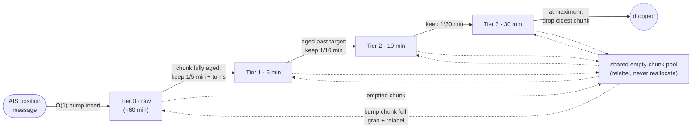
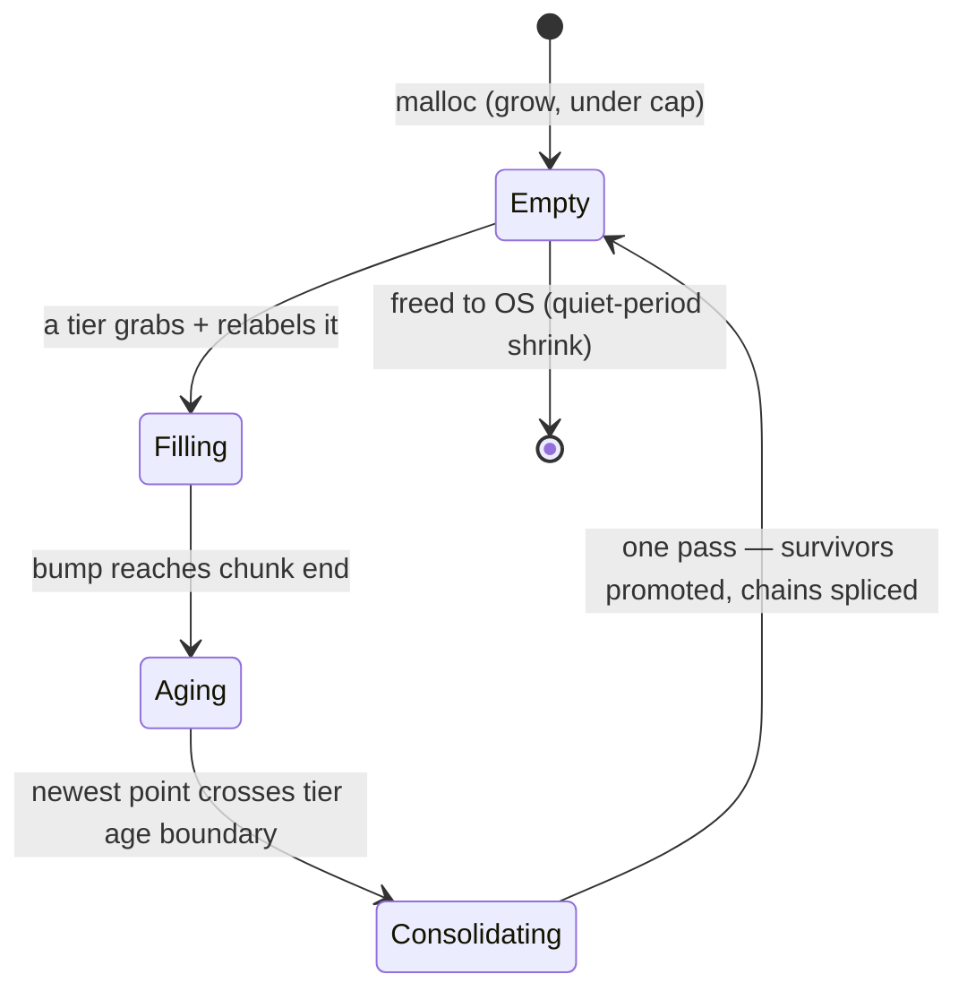

# Track History Storage — Design

Status: agreed design (rev 6, tiered chunk lists + age-triggered whole-chunk
consolidation), not yet implemented (July 2026).
Origin: Discord request (elmarko182) to make the v0.67 250-point track cap
configurable; grew into a redesign of path storage for long, animatable,
memory-bounded track history. The design went through several dead ends —
**read Design history before "simplifying" anything.**

## Goals

- Long track history (24 h+) with bounded, configurable memory.
- Full detail for the recent past; graceful, automatic coarsening under
  memory pressure — never a crash, never a hard cliff.
- Per-point animation data (speed, course, heading).
- Small installs pay ~1 MB and keep raw detail for hours; busy stations
  degrade granularity oldest-first within the cap; memory shrinks back after
  busy periods.
- Replace the flat 250-point serialization cap (server) and `slice(0, 250)`
  (client) with a coherent scheme shared by both.

## Current implementation (to be replaced)

- `DB.h`: global ring `paths[]`, `Npaths = Nships * 16`, `PathPoint` = 40 B
  `{float lat, lon; uint32_t mmsi; time_t ts_start, ts_end; int count, next}`.
- Per-ship singly-linked chains newest→oldest (`next` index, `path_ptr` head).
- Ring allocation overwrites slots regardless of owner → chain integrity needs
  the `isNextPathPoint` heuristic (mmsi match + count monotonicity) tolerating
  stolen slots.
- Serialization caps at 250 points (`writeSinglePathJSONCompact`, DB.cpp ~:425);
  the `...Since` delta variant is uncapped (v0.66 vs v0.67 user confusion).
- Stationary clustering updates the chain head in place
  (`addToPath`, dist < 1e-6: extend `ts_end`).

## Design overview (RRD-style tiered rings, one mechanism)

Storage is a set of **granularity tiers** — raw, then coarser spacings
(default 5 min, 10 min, 30 min) — each tier a time-ordered sequence of
chunks, all drawn from one shared chunk pool capped by `TRACK_MEM`.



- **Writes**: tier 0 chunks are bump-filled by raw inserts; tier k chunks
  are bump-filled by promotions from tier k−1 consolidation — *the same
  insert mechanism*, aimed one tier coarser.
- **Invariant: every tier's chunks are time-sorted with disjoint ranges** —
  no overlap, ever. Guaranteed by whole-chunk migration: survivors leave
  tier k in oldest-chunk order and append in order to tier k+1 (partial or
  per-ship migration would interleave — the whole-chunk rule is load-bearing
  for this, not just a performance choice). It buys: chunk-level time search
  (skip whole chunks per range comparison on since/time-window reads), the
  one-comparison consolidation trigger, a provable debug assertion
  (`next_older` only ever moves to an older-or-equal chunk range — replaces
  the old `isNextPathPoint` heuristic), and sort-free backup/restore.
- **Consolidation is age-triggered and whole-chunk**: when a tier-k chunk's
  *newest* point crosses the tier's age boundary (60 min for tier 0), the
  whole chunk is consolidated in one pass — spacing/turn survivors are
  re-inserted into tier k+1 (the same insert mechanism), the rest are
  dropped by the splice, and the chunk goes empty atomically. No
  half-migrated chunks, one sequential scan, one comparison as trigger.
  Points linger at most one chunk-timespan past the boundary — invisible.
  The chunk's fix-up entries provide every chain predecessor without walks.
- **At maximum** (`TRACK_MEM` reached and a chunk is needed): walk back
  over the granularities to the coarsest non-empty tier and drop its oldest
  chunk — the globally oldest, most-expendable data, released wholesale via
  the same consolidate routine in keep-nothing mode (the splice through the
  fix-up entries is what prevents dangling links; never a raw free).
- Inserts are strictly O(1). There are **no per-point free lists, no
  eviction heap, no per-ship anchors, no gate walks, no background
  threads** — all deleted in favor of the single consolidation mechanism
  (see Design history for what each replaced).

Points are 20 bytes, AIS wire units, singly linked new→old per ship — the
same chain shape as the current code; a ship's chain runs raw → 5 min →
10 min → 30 min across tiers transparently (handles are handles):

```
ship.newest
   │        tier 0 (raw)              tier 1 (5 min)      tier 2       tier 3
   ▼   ┌────────────────────┐   ┌──────────────────┐   ┌────────┐   ┌────────┐
   ●──▶●──▶●──▶●──▶●──▶●──▶●──▶ ○────▶○────▶○────▶○──▶ ◇─────▶◇──▶ △──▶ NONE
       └────────────────────┘   └──────────────────┘   └────────┘   └───▲────┘
        every position, ≤60min    one per 5 min           10 min        │
                                                                  ship.oldest

   one singly-linked chain (next_older), oldest point = tail, always
```

### Point layout (20 bytes, AIS wire units)

```cpp
typedef uint32_t PtRef;               // (chunk << 12) | slot; NONE sentinel

struct PathPoint {
    int32_t  lat, lon;                // AIS scaled ints, 1/600000 deg (exact)
    uint32_t ts;                      // epoch secs, arrival at this position
    uint32_t sog_cog_hdg;             // packed 10 (0.1 kn) + 12 (0.1 deg) + 9 (deg)
                                      // + 1 spare bit, currently unused
    PtRef    next_older;              // per-ship chain toward tail — only link
};
```

Rationale:
- AIS scaled ints are exact (float32 is marginal at 7 significant digits) and
  AIS sentinels (sog 1023, cog 3600, hdg 511) represent "not available" for
  free — the frontend can distinguish "no heading" from "heading 0" per
  point, which matters for animation.
- One timestamp, not a clustering window: dwell time at a point is the gap
  to the next-newer point's `ts` (for the head: ship.last_signal). Stationary
  clustering simplifies to "if close to head, do nothing" — no in-place
  update, no ts_end, and the delta endpoint never re-sends moored ships.
- Single link, new→old — identical direction to the current code. Reads get
  their ideal direction (newest-first, early stop). Predecessors, where
  needed, come from per-chunk fix-up lists — never from walks.
- No per-point mmsi: ownership comes from the ship on reads/inserts and from
  the fix-up list at wipe time.
- Per-ship state is only `newest, oldest, count`.

### Chunks and handles

- Chunk = 2^12 = 4096 points = 80 KB (+ header). `deref(h) =
  chunks[h >> 12][h & 0xFFF]` (power of two: shift + mask). One global chunk
  table for all tiers; a chunk keeps its table index (and address) forever —
  relabeling changes the header, never the memory.
- **Chunk size trade-off** (one compile-time constant; 2^12 is the default):
  smaller chunks give finer reclamation granularity, smaller consolidation
  bursts, and a lower quiet-station floor — but fix-up entries are recorded
  when consecutive points of a ship land in different chunks, so bookkeeping
  stays sparse only while `chunk_points >> active ships` (chunk time-span >>
  reporting interval). Tiny chunks (e.g. 128 points) span seconds and force
  ~one 8 B entry per 20 B point (+40% on the raw tier) while optimizing a
  burst that is already ~50 us. At extreme rate x ship counts even large
  chunks go fix-up-dense — inherent, so budget the entry format (ship uint16
  + gen + PtRef = 8 B), don't fight it with size.
- **Seal-by-age**: close a tier's bump chunk early when its time-span exceeds
  the tier's window, so half-full chunks on quiet stations still age out and
  chunk spans stay bounded at both extremes.
- **Chunks are shared, not reallocated**: a wiped chunk goes onto a shared
  empty-chunk list and any tier relabels it when its bump chunk fills —
  often tier k+1 immediately reuses the very chunk tier k just wiped (the
  "upgrade": consolidation keeps ~half the points, so each compression round
  nets free space). malloc only to GROW the pool under the cap; free to the
  OS only on quiet-period shrink. Steady state has zero allocator traffic.


- If malloc fails: behave as if the cap were reached (compress/wipe).
  Graceful, no crash.
- **Crossing fix-up list** (what makes wipes walk-free): on ANY point write —
  raw insert or promotion copy — if `p.next_older` lands in a different
  chunk, append `(ship_index, handle_of_p)` to that OLDER chunk's fix-up
  list. O(1); at most ~one entry per active ship per chunk (KBs). At wipe,
  this hands over every ship's chain predecessor directly.
- Chunk header: granularity (tier), fill level (bump cursor — slots are
  linear in time), `latest_ts` (of the last filled slot — the consolidation
  trigger), prev/next in the tier's doubly-linked chunk list, and the
  fix-up/touched entries.
- **No ring sizing, no burst protection needed**: consolidation is
  age-triggered (below), so each tier's chunk count floats with the observed
  rate automatically — chunks are acquired as data arrives and freed as
  whole chunks age past the tier boundary.

### Consolidation (one routine, every tier)

```
consolidate(C, promote = true):            # C = oldest chunk of its tier k;
                                           # trigger: C.latest_ts < now − boundary[k]
                                           # promote=false: keep-nothing (drop) mode
    starts = C.fixups                      # (ship, gen, pred) crossings into C
           + [(s, gen, NONE) for s in C.touched      # fully-silent ships:
              if chunkOf(ships[s].newest) == C]      #   run starts at newest
    for (s, gen, pred) in starts:
        ship = ships[s]
        if ship.generation != gen: continue           # slot reused → stale
        if pred != NONE and chunkOf(deref(pred).next_older) != C:
            continue                                  # pred re-promoted → stale
        first = (pred != NONE) ? deref(pred).next_older : ship.newest
        run   = collect from first via next_older while inside C
        cont  = deref(run.tail).next_older            # coarser points, or NONE
        kept  = []
        ref   = (cont != NONE) ? deref(cont) : NONE   # older kept neighbour
        for p in reversed(run):                       # process old → new
            if not promote: continue                  # keep-nothing mode: drop
                                                      #   (coarsest tier, and
                                                      #    makeSpace at maximum)
            if ref == NONE
               or p.ts >= ref.ts + spacing[k+1]
               or |cog(p) − cog(ref)| > TURN_KEEP_DEG:        # turn preserve
                t = tierAppend(k+1, copy of p)        # promote
                kept.append(t); ref = deref(t)
            # else: nothing — dropping is implicit, slot just gets overwritten
        link kept newest→oldest; tail of kept → cont
        if pred != NONE: deref(pred).next_older = kept.head or cont
        else:            ship.newest             = kept.head or cont
        if cont == NONE: ship.oldest = kept.tail or pred (or NONE if shipless)
        record new cross-chunk fix-ups for every link written above
        ship.count -= dropped
    reset C: bump = 0, clear fixups/touched   # → empty list, any tier reuses
```

For the coarsest tier there is no k+1: the same routine with "keep nothing" —
predecessors' `next_older` set to the run's old continuation, which is NONE
by construction (older chunks were wiped first); `ship.oldest` updated.

```
        tier-k chunk being consolidated                tier k+1 bump chunk
      ┌──────────────────────────────────┐           ┌───────────────────┐
      │ [a3][b7][a2][c1][a1][b6][c0] ... │           │ ... [a2'][b6']◀bump│
      └──────────────────────────────────┘           └───────────────────┘
fix-ups (recorded at write time):
 (A, pA) ─▶ run A: a3→a2→a1   keep a2 (spacing) ──copy──▶ a2'
 (B, pB) ─▶ run B: b7→b6      keep b6 (turn)    ──copy──▶ b6'
 (C, pC) ─▶ run C: c1→c0      keep none

splice each ship around the wiped chunk:
 before:  pA ─▶ a3 ─▶ a2 ─▶ a1 ─▶ (A's points in coarser tiers)
 after:   pA ────────▶ a2' ─────▶ (A's points in coarser tiers)
```

Properties:
- Insert: strictly O(1) (bump + link + occasional fix-up append + cluster
  check). No walks anywhere in the message path.
- Consolidation: one sequential pass over one fully-aged chunk (112 KB scan
  + ~5% survivor copies — tens of us even on a Pi). No half-migrated
  state: the chunk goes empty atomically. If the burst ever matters, it can
  be sliced (process a few fix-up entries per insert once triggered) as pure
  latency smoothing — the logical semantics stay whole-chunk.
- Silent ships need no special handling — their points meet consolidation
  like everyone else's; oldest-first processing presents candidates in time
  order.
- Fix-up entries can go stale (ship removed; pred itself already promoted).
  Validate at consolidation: `deref(pred).next_older` must point into the
  chunk being processed and the generation must match; else skip the entry.

### Key functions (pseudocode)

```
deref(h):                                   # handle → point, everywhere
    return chunk_table[h >> 12].points[h & 0xFFF]

addPoint(ship, msg):                        # the message path — strictly O(1)
    if ship.newest != NONE:
        head = deref(ship.newest)
        if dist(head, msg) < CLUSTER_EPS:            # stationary clustering:
            return                                   #   do nothing — dwell =
                                                     #   gap to next-newer ts
    h = tierAppend(0, makePoint(msg))                # AIS wire units
    deref(h).next_older = ship.newest
    if ship.newest == NONE:
        ship.oldest = h                              # first point = tail
        chunkOf(h).touched.add(ship.index, ship.generation)
    else if chunkOf(ship.newest) != chunkOf(h):      # chain crosses chunks:
        chunkOf(ship.newest).fixups.add(ship.index, ship.generation, h)
        chunkOf(h).touched.add(ship.index, ship.generation)
    ship.newest = h; ship.count++

tierAppend(k, point):                       # bump into tier k's newest chunk
    C = tier[k].bump_chunk
    if C == NONE or C.bump == CHUNK_POINTS:
        C = acquireChunk(k)
    C.points[C.bump] = point
    return handle(C, C.bump++)

acquireChunk(k):
    if empty_list:              C = pop(empty_list)
    else if nchunks < cap:      C = malloc_chunk()   # grow (fail → makeSpace)
    else:                       C = makeSpace()      # at maximum
    C.tier = k; C.bump = 0; clear fixups/touched
    tier[k].push_newest(C); tier[k].bump_chunk = C
    return C

ageCheck():                                 # cheap; from the insert path
    for k in tiers:                         # (or once per second)
        C = tier[k].oldest_chunk
        if C != bump_chunk and C.latest_ts < now − boundary[k]:
            consolidate(C)                  # whole chunk → empty_list

makeSpace():                                # at TRACK_MEM, chunk needed
    j = coarsest non-empty tier             # walk back over granularities
    consolidate(tier[j].oldest_chunk, promote = false)
    # keep nothing: preds → NONE, ship.oldest fixed — that chunk holds the
    # globally oldest data and its continuation is NONE by construction.
    # NOT a raw free: the splice is what prevents dangling next_older links.
    return pop(empty_list)

writePathJSON(ship, since = 0, maxN = ∞):   # newest → oldest, early stop
    h = ship.newest; n = 0
    while h != NONE and n < maxN:
        p = deref(h)
        if p.ts < since: break                       # delta requests: O(delta)
        emit(p.lat / 600000.0, p.lon / 600000.0,
             unpack sog/cog/hdg with AIS sentinels → null)
        h = p.next_older; n++

removeShip(ship):                           # ship DB recycles the slot
    ship.newest = ship.oldest = NONE; ship.count = 0
    ship.generation++                        # invalidates its fix-up/touched
                                             # entries lazily — no chain walk,
                                             # points rot in place until wiped
```

Notes:
- `ship.generation` is a small counter bumped on slot reuse; fix-up and
  touched entries carry it so wipes skip entries from a ship's former life.
- **Reserve chunk**: keep one empty chunk in reserve for consolidation
  output — `consolidate` needs a destination before its source is freed;
  the emptied chunk immediately replenishes the reserve. Without it, an
  at-maximum consolidation could deadlock on its own destination.
- `makeSpace` recursion is bounded: consolidating tier j may call
  `tierAppend(j+1)` which may `acquireChunk(j+1)` — served from the reserve,
  never re-entering `makeSpace`.

### Tiers, retention, elasticity

Default spacing ladder: `raw, 5 min, 10 min, 30 min`. Boundaries between
tiers are **elastic**: with free pool, tiers simply grow (a quiet station
keeps raw detail for hours — retention per tier = chunk count × fill time);
under pressure, compression takes the oldest fine chunk first. Degradation
is automatic, oldest-and-finest first, and reverses when load drops.

```
what a track looks like, by age (default targets):

 now ◀──────────────────────────────────────────────────────────── past
 │███████████████│▓▓ ▓▓ ▓▓ ▓▓ ▓▓ ▓▓│ ▒   ▒   ▒   ▒  │  ░     ░    │ (gone)
 │  raw ≤60 min  │  5 min → 2 h    │ 10 min → 24 h   │ 30 min → cap│
 └───────────────┴─────────────────┴─────────────────┴─────────────┘
  busy station: boundaries pushed left (coarsen earlier), cap enforced
  quiet station: boundaries drift right (raw detail kept for hours)
```

Fill-time intuition at 4096 active ships: tier 1 (5 min) fills a 4 K chunk
in ~5 min, tier 3 (30 min) in ~30 min; typical stations minutes-to-hours per
chunk, with seal-by-age bounding the span on quiet ones.

### Read path / serialization

- Walk newest→oldest via `next_older` — natural direction across tiers; stop
  at cap or since-watermark. Since-requests O(delta) with a ship-level
  last-update skip.
- Emit lat/lon by dividing scaled ints; AIS sentinels map to null/absent.
- Per-ship `count` supports newest-N caps and pre-sized output.

### Concurrency

One DB-level mutex — the same two-thread model as the current code (decoder
thread writes, webserver thread reads). Longest critical section is one
consolidation (~80 KB sequential scan, tens of us); inserts and reads are
shorter. Escalation path if serialization ever measurably stalls decoding:
a reader-writer lock (pthread rwlock; C++11 has no shared_mutex). 

Per-chunk mutexes: considered and rejected. No operation stays inside one
chunk — chain walks hop chunks in chain order while consolidation would
lock in scan order (deadlock geometry or torn reads), and a splice touches
three places atomically (pred's chunk, destination bump chunk, ship
record). Fine-grained locking pays off for long critical sections or many
contenders; we have neither.

Parallel compaction (designed-for, not built): consolidation splits cleanly
at an existing seam into two phases — (1) plan+copy WITHOUT the lock: scan
the source chunk (cold — writes only touch bump chunks), copy survivors to
the destination bump chunk (compactor-private — only consolidation writes
coarse tiers), build the splice list; (2) splice UNDER the mutex: re-validate
each entry (the generation/pred staleness checks that exist anyway), apply
pointer writes, unlink the chunk — single-digit us. The one real race: a
silent ship reappearing mid-scan links new points + a fix-up entry into the
source chunk; phase-2 validation catches it (re-do or defer that run).
Implement inline first; promote to a background thread only if profiling
shows the tens-of-us burst mattering.

### Backup / restore

- Backup: per ship, dump points newest→oldest as payload-only runs (handles
  never persisted).
- Restore: replay per-ship runs into tiers by age (each tier bump-filled in
  time order, fix-up lists rebuilt by the same insert rule). No global sort,
  no anchor reconstruction (none exist).

### Configuration

Two settings; everything else derives or is a compile-time constant.

- `TRACK_MEM` — hard memory cap in MB (default ~32). Internally
  `max_chunks = floor(MB * 2^20 / (chunk + header + fixup watermark))`,
  ~12 chunks/MB. The only hard limit in the system: bounds RSS regardless of
  traffic; enforced by makeSpace dropping the coarsest tail. Replaces the
  implicit `Nships * 16`.
- `TRACK_THIN` — the compaction ladder, `boundary_min:spacing_min` pairs,
  default `60:5,120:10,1440:30` (raw 60 min; 5-min to 2 h; 10-min to 24 h;
  30-min beyond). Contract:
  - Boundaries are TARGETS, not guarantees: with spare memory tiers stretch
    past them (quiet stations keep raw detail for hours); at the cap the
    oldest-coarsest chunk drops first. The ladder shapes HOW history
    degrades; TRACK_MEM decides WHEN.
  - One pair (`60:5`) = simple two-tier mode; `off` = no thinning (pure raw
    ring until the cap).
  - Validate: boundaries and spacings strictly increasing.
- Deliberately NOT settings (constants): chunk size (2^12), turn-preserve
  threshold (~12 deg), CLUSTER_EPS (identical to current addToPath).
- Control hub shows a derived, read-only estimate from the observed insert
  rate: e.g. "raw: 1 h 40 m / 5-min: 9 h / 10-min: 3 d / memory 11/32 MB" —
  tuning becomes reading.
- The 250-point server serialization cap becomes configurable/removed
  accordingly.

### Frontend counterpart

- script.js `paths[mmsi].slice(0, 250)` (~:3770) replaced by a client-side
  mirror of the spacing ladder (merge by spacing per age band) so
  long-session accumulation via the delta endpoint stays bounded and
  consistent with a reload.
- Animation: per-point sog/cog enables dead-reckoning interpolation between
  spaced points; turns covered by turn-preserved points.

## Memory budget (20 B/point)

- Tier 0: raw-rate × window. Extreme 400 pts/s × 60 min ≈ 1.44 M pts ≈
  29 MB; typical busy 50 pts/s ≈ 3.5 MB; quiet = 1–2 chunks.
- Coarse tiers: 12 pts/ship-h (5 min) falling to 2 pts/ship-h (30 min) —
  worst case ~10–20 MB for multi-day retention at 4096 ships; typical a few
  MB.
- Quiet station total ≈ 1 MB, with hours of raw detail (elastic tiers).
- Under any load, hard-capped by `TRACK_MEM`; degradation = coarsening,
  oldest-finest first.
- Prior art: this is RRDtool's architecture (rings per resolution,
  consolidation at rollover) with elastic tier boundaries; Prometheus
  validates wholesale time-ordered drops as the only deletion mechanism
  (it has no per-sample delete); readsb/Prometheus per-series chunk layout
  remains the alternative if bulk-read locality ever measures as a
  bottleneck. Gorilla-style delta compression (~6–10 B/pt) is a possible
  future win but requires per-ship contiguous runs — incompatible with the
  linked-chain reads; parked.

## Design history (decisions and dead ends — keep for context)

1. **Per-point global ring (current code)**: stolen slots force integrity
   heuristics; no eviction ordering; fixed reservation.
2. **Single-owner 64-point chunks** (readsb-like): best read locality but a
   full rewrite with compaction/coalescing; the tiered rings get write
   locality via bump order without per-ship chunk ownership.
3. **Per-point age list, doubly linked (44 B/pt)**: correct but 45% of every
   point was bookkeeping.
4. **Single-linked age list + tombstones — FATALLY FLAWED.** Tombstoned slots
   could only be reused after everything inserted before them was popped: at
   capacity the pool churned in insertion order at the *raw* rate, mowing
   down live anchors at age `cap ÷ rate` (≈ 54 min at 400 pts/s). **Lesson:
   freed space must be promptly reusable OR the reclamation unit must be
   time-aligned so wholesale drop only hits data that is genuinely oldest.**
   Rev 5 satisfies the second form: every tier reclaims oldest-first, and
   survivors are copied out *before* the wipe.
5. **Sweep-time relocation with per-survivor chain walks (rev 2)** → replaced
   by insert-driven gate promotion (rev 3, ~35 derefs/insert) → replaced by
   wipe-time promotion with crossing fix-up lists (rev 4, O(1) inserts) →
   generalized to every tier (rev 5). Each step moved work off the message
   path and deleted a structure.
6. **Ship-tail eviction min-heap (revs 2–4)**: answered "which live point is
   globally oldest?" for per-point capacity eviction. Deleted in rev 5 —
   capacity is handled by wiping the coarsest tier's oldest chunk, so no
   per-point eviction path exists.
7. **Tenured free list (revs 3–4)**: deleted — coarse tiers are bump-filled
   time-ordered rings like tier 0, so nothing recycles per-slot.
8. **Per-ship anchor handles / gate cascade (revs 3–4)**: deleted — the
   spacing reference during consolidation is the older kept neighbor already
   in the chain; consolidation order (oldest chunk first) makes it correct.
9. **Tagged tail back-refs, per-slab drain policies, chunk age lists**: all
   deleted earlier — subsumed by tier ordering + fix-up lists.
10. **Overlapping resolutions (Thanos/Mimir-style: raw + 5 m + 1 h coexist
    for the same period)**: rejected — the reader would have to choose a
    resolution and dedup at seams ("when to cross"), memory doubles, and a
    point can occupy only one chain position anyway. The per-ship chain IS
    the resolution selector: each moment exists once, at the finest
    granularity still alive for its age; tier crossing is just next_older.

## Implementation notes

- C++11: no make_unique; chunk table as vector of raw/unique_ptr arrays.
- The old integrity checker (DB.cpp ~:1534) and `isNextPathPoint` are
  removed; validity is structural.
- Keep `CLUSTER_EPS` behavior identical to current `addToPath` (d < 1e-6).
- Promotion fix-ups (all in hand at wipe): pred's `next_older`, `ship.oldest`
  if the run contained the tail, `ship.newest` if pred is NONE.
- Ship removal from the ship DB: NO chain walk, ever — generation bump only.
  The removed ship's points sit untouched (chunks stay linear) and die at
  consolidation: their fix-up entries fail the generation check, so they are
  neither promoted nor spliced, and the whole-chunk empty sweeps them away.
- Consolidation copies survivors OUT to tier k+1's bump chunk, then relabels
  the emptied chunk (copy-then-relabel). A strictly in-place upgrade
  (compact survivors to the chunk's own front) is possible but hazardous:
  the wipe visits slots per-ship-run, not sequentially, so front-compaction
  can overwrite unprocessed slots — it needs a mark phase + slot map. The
  copy is ~230 KB per ~20 min; prefer copy-then-relabel.
- Worst-case per-message cost: O(1) insert + optional incremental wipe slice.
  No unbounded or rate-proportional work anywhere in the write path.
